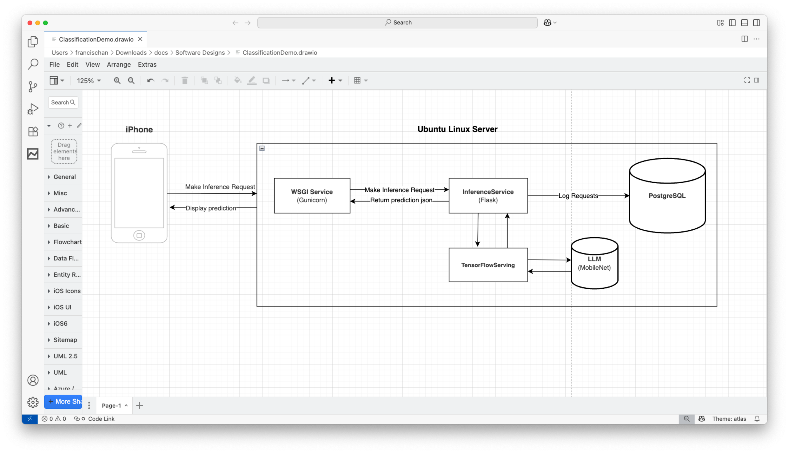
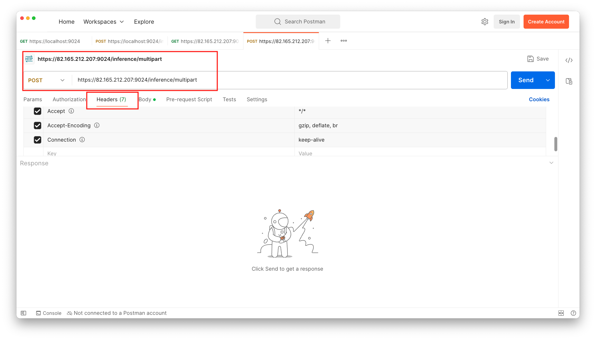
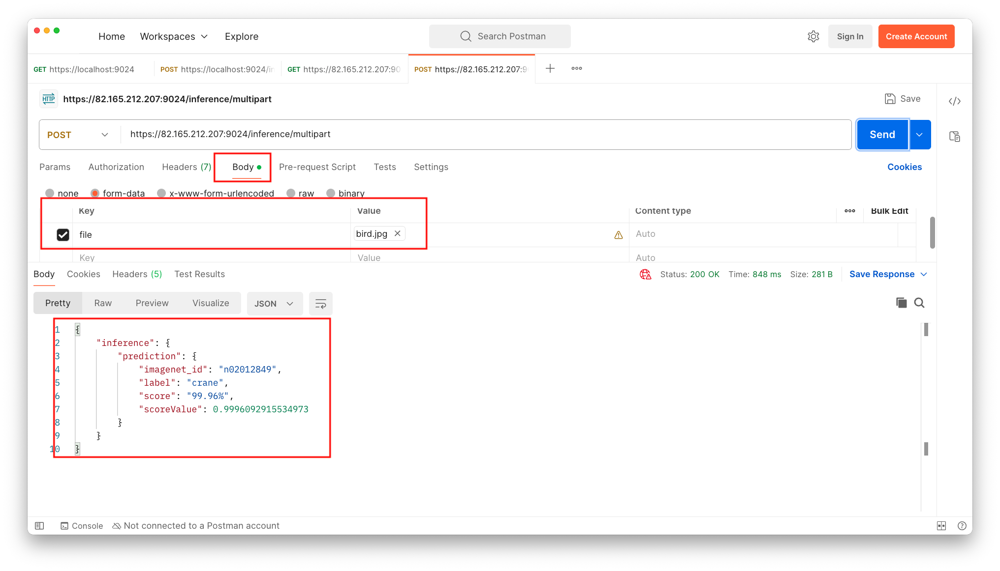

# Image Classification Service (BETA) v1.0
The "Image Classification Service" is the interface to the backend LLM used to make predictions. The service can be use from an web app, IOS app or any other app.

*NOTE: This service is still in beta using a custom self signed certificate.

Architecture:

You can try out this service using "Postman" with images provided in the "TestImages" folder or any other image. The service returns a json string with a prediction score for the uploaded image.

The service logs any uploaded images along with the prediction score for analytics purposes.